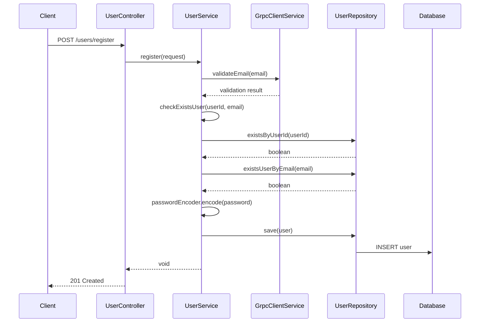
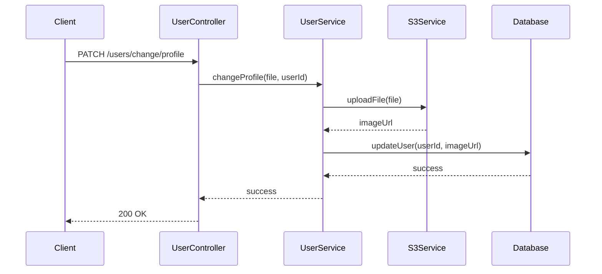

# User Server PRD - 비즈니스 로직

## 1. 사용자 등록 프로세스



## 2. 토큰 관리 시스템

### 2.1 토큰 감소
- 사용자가 특정 기능 사용 시 토큰 소모
- 잔여 토큰 부족 시 `InsufficientRemainTokenException` 발생
- Kafka 이벤트 발행으로 다른 서비스에 알림

### 2.2 토큰 증가
- 관리자 또는 시스템에 의한 토큰 지급
- Kafka 이벤트를 통한 토큰 증가 처리

### 2.3 토큰 이벤트 정의

#### 2.3.1 토큰 증가 이벤트
```json
{
    "userId": "string",
    "tokenCount": "long",
    "timestamp": "datetime"
}
```

#### 2.3.2 토큰 감소 이벤트
```json
{
    "userId": "string",
    "tokenCount": "int",
    "timestamp": "datetime"
}
```

## 3. 권한 관리 시스템

### 3.1 Role 기반 접근 제어 (RBAC)
- **USER**: 일반 사용자 권한
  - 본인 프로필 조회/수정
  - 본인 토큰 사용
  - 본인 계정 삭제

- **ADMIN**: 관리자 권한
  - 모든 사용자 조회
  - 다른 관리자 등록
  - 토큰 관리
  - 시스템 관리 기능

### 3.2 권한 검증 로직
```java
public void validateUserPermission(String requestUserId, String targetUserId, UserRole role) {
    if (!role.equals(UserRole.ADMIN) && !requestUserId.equals(targetUserId)) {
        throw new UnauthorizedException("권한이 없습니다.");
    }
}
```

## 4. 프로필 관리 시스템

### 4.1 프로필 이미지 업로드
- 지원 파일 형식: JPG, PNG, GIF
- 최대 파일 크기: 5MB
- 자동 리사이징 및 최적화
- CDN을 통한 빠른 이미지 제공

### 4.2 프로필 이미지 처리 플로우


## 5. 비즈니스 규칙

### 5.1 사용자 등록 규칙
- 사용자 ID는 중복될 수 없음
- 이메일은 중복될 수 없음
- 비밀번호는 암호화하여 저장
- 기본 토큰은 10,000개 지급
- 기본 권한은 USER

### 5.2 토큰 사용 규칙
- 토큰은 음수가 될 수 없음
- 토큰 부족 시 해당 기능 사용 불가
- 토큰 변경 시 이벤트 발행 필수

### 5.3 권한 관리 규칙
- ADMIN만 다른 ADMIN 생성 가능
- 본인 정보만 수정 가능 (ADMIN 제외)
- 삭제된 사용자는 복구 불가

### 5.4 데이터 유효성 규칙
- 이메일 형식 검증
- 사용자 ID 형식 검증 (영문, 숫자, 특수문자 조합)
- 비밀번호 강도 검증
- 파일 크기 및 형식 검증